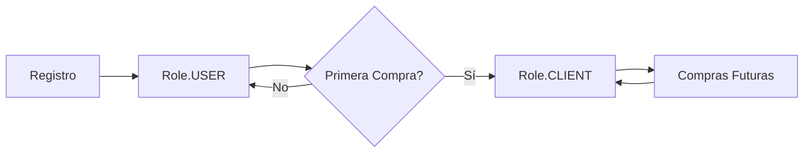

# 🎯 Sistema de Promoción de Usuarios

## 📋 Descripción General

El backend implementa un sistema automático de promoción de usuarios basado en su comportamiento de compra. Los usuarios registrados son promovidos automáticamente a clientes después de su primera compra.

## 🔄 Flujo de Roles



### Estados de Usuario:

1. **USER** (Usuario Registrado)

   - Usuario recién registrado
   - Sin historial de compras
   - Acceso básico a la plataforma

2. **CLIENT** (Cliente)

   - Usuario con al menos 1 compra
   - Promoción automática tras primera compra
   - Acceso a beneficios de cliente

3. **ADMIN** (Administrador)
   - Acceso completo al panel de administración
   - Gestión de productos, categorías, usuarios

## 🔌 Endpoints del Backend

### Gestión de Usuarios (Admin)

#### GET `/api/admin/users`

**Descripción**: Lista usuarios SIN compras (Role.USER)

**Response**:

```json
{
  "success": true,
  "message": "Users retrieved",
  "data": [
    {
      "id": 1,
      "email": "user@example.com",
      "firstname": "Juan",
      "lastname": "Pérez",
      "role": "USER",
      "enabled": true
    }
  ]
}
```

#### GET `/api/admin/clients`

**Descripción**: Lista usuarios CON compras (Role.CLIENT)

**Response**:

```json
{
  "success": true,
  "message": "Clients retrieved",
  "data": [
    {
      "id": 2,
      "email": "client@example.com",
      "firstname": "María",
      "lastname": "González",
      "role": "CLIENT",
      "enabled": true,
      "purchaseCount": 5
    }
  ]
}
```

#### PUT `/api/admin/users/{id}/status`

**Descripción**: Actualiza el estado habilitado/deshabilitado de un usuario

**Request**:

```http
PUT /api/admin/users/1/status?enabled=false
```

**Response**:

```json
{
  "success": true,
  "message": "User status updated",
  "data": {
    "id": 1,
    "enabled": false
  }
}
```

## 🎯 Casos de Uso en el Frontend

### 1. Vista de Usuarios (`/adminUsers`)

Muestra usuarios que **NO han comprado** (Role.USER)

```typescript
// Llamar a /api/admin/users
const response = await api.get('/api/admin/users')
const users = response.data.data // Solo usuarios sin compras
```

**Acciones disponibles**:

- Ver detalles del usuario
- Habilitar/Deshabilitar cuenta
- Enviar email de bienvenida
- Ofrecer promoción de primera compra

### 2. Vista de Clientes (`/adminClients`)

Muestra usuarios que **SÍ han comprado** (Role.CLIENT)

```typescript
// Llamar a /api/admin/clients
const response = await api.get('/api/admin/clients')
const clients = response.data.data // Solo clientes con compras
```

**Acciones disponibles**:

- Ver historial de compras
- Gestionar estado de cliente
- Programas de fidelización
- Descuentos exclusivos

### 3. Proceso de Compra

La promoción ocurre **automáticamente** en el backend:

```typescript
// Frontend solo crea la orden
const response = await api.post('/api/orders/create-from-cart')

// Backend automáticamente:
// 1. Crea la orden
// 2. Verifica si es primera compra
// 3. Promociona USER → CLIENT si aplica
```

## 💡 Oportunidades de Negocio

### Programas de Fidelización

```typescript
// Identificar clientes frecuentes
const frequentClients = clients.filter((c) => c.purchaseCount >= 10)

// Ofrecer descuentos especiales
const vipClients = clients.filter((c) => c.purchaseCount >= 50)
```

### Campañas de Marketing Segmentadas

#### Para Usuarios (Sin compras)

- Email: "¡Completa tu primera compra y obtén 10% de descuento!"
- Banner: "Nuevos usuarios: Envío gratis en primera compra"
- Notificación: "Descubre nuestros productos más vendidos"

#### Para Clientes (Con compras)

- Email: "¡Gracias por ser cliente! Aquí tienes un cupón exclusivo"
- Banner: "Programa de puntos: Acumula y canjea"
- Notificación: "Nuevos productos que te pueden interesar"

### Análisis de Conversión

```typescript
// Tasa de conversión USER → CLIENT
const totalUsers = users.length
const totalClients = clients.length
const conversionRate = (totalClients / (totalUsers + totalClients)) * 100

console.log(`Tasa de conversión: ${conversionRate.toFixed(2)}%`)
```

## 🔧 Implementación en el Frontend

### Actualizar `api.ts`

```typescript
export const UserService = {
  // Lista usuarios sin compras
  getUsers: () => api.get('/admin/users'),

  // Lista clientes con compras
  getClients: () => api.get('/admin/clients'),

  // Actualizar estado
  updateStatus: (id: number, enabled: boolean) =>
    api.put(`/admin/users/${id}/status`, null, { params: { enabled } }),
}
```

### Vista de Usuarios

```vue
<script setup>
import { ref, onMounted } from 'vue'
import { UserService } from '@/services/api'

const users = ref([])

const fetchUsers = async () => {
  const response = await UserService.getUsers()
  users.value = response.data.data || response.data
}

onMounted(() => fetchUsers())
</script>

<template>
  <div>
    <h2>Usuarios Registrados (Sin compras)</h2>
    <div v-for="user in users" :key="user.id">
      {{ user.firstname }} {{ user.lastname }}
      <span class="badge">Nuevo Usuario</span>
    </div>
  </div>
</template>
```

### Vista de Clientes

```vue
<script setup>
import { ref, onMounted } from 'vue'
import { UserService } from '@/services/api'

const clients = ref([])

const fetchClients = async () => {
  const response = await UserService.getClients()
  clients.value = response.data.data || response.data
}

onMounted(() => fetchClients())
</script>

<template>
  <div>
    <h2>Clientes (Con compras)</h2>
    <div v-for="client in clients" :key="client.id">
      {{ client.firstname }} {{ client.lastname }}
      <span class="badge">{{ client.purchaseCount }} compras</span>
    </div>
  </div>
</template>
```

## 📊 Métricas Recomendadas

### Dashboard de Administración

```typescript
const metrics = {
  totalUsers: users.length,
  totalClients: clients.length,
  conversionRate: (clients.length / (users.length + clients.length)) * 100,
  averagePurchases: clients.reduce((sum, c) => sum + c.purchaseCount, 0) / clients.length,
  topClients: clients.sort((a, b) => b.purchaseCount - a.purchaseCount).slice(0, 10),
}
```

## ✅ Checklist de Implementación

- [ ] Actualizar `api.ts` con `UserService`
- [ ] Crear vista `/adminUsers` para usuarios sin compras
- [ ] Actualizar vista `/adminClients` para clientes con compras
- [ ] Agregar badges/indicadores de rol en las vistas
- [ ] Implementar filtros por estado (habilitado/deshabilitado)
- [ ] Agregar métricas de conversión en dashboard
- [ ] Crear campañas de email segmentadas
- [ ] Implementar programa de fidelización
- [ ] Agregar descuentos para primera compra
- [ ] Mostrar historial de compras en detalle de cliente

## 🎉 Beneficios del Sistema

✅ **Segmentación automática**: No requiere intervención manual
✅ **Marketing dirigido**: Campañas específicas por segmento
✅ **Análisis de conversión**: Métricas claras de USER → CLIENT
✅ **Programas de lealtad**: Recompensas basadas en compras
✅ **Experiencia personalizada**: Contenido relevante por rol

---

**Nota**: El sistema está completamente implementado en el backend y listo para usar. Solo necesitas actualizar el frontend para aprovechar la segmentación de usuarios.
